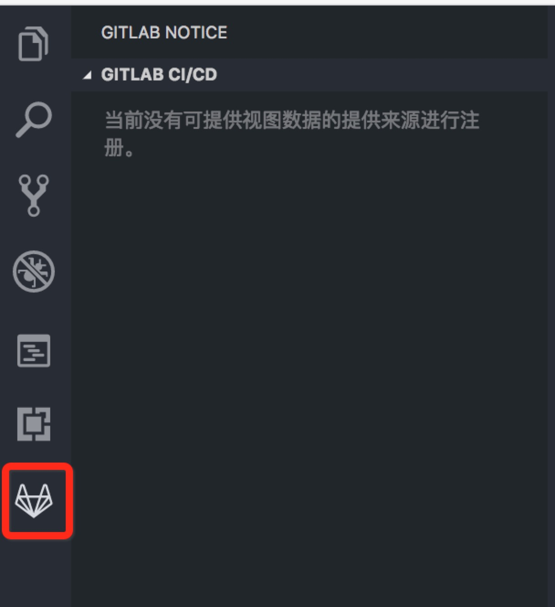

# gitlab-notice

## 背景
程序员在日常开发中，对每个需求用代码把功能实现外，更重要的是对代码的管理。

开发完成后除了提交自己码好的代码外，还要把代码提交合并，并且在gitlab上部署好的 CI/CD 中查看构建情况。这时出现的情景就是需要在浏览器中重新打开gitlab定位到当前开发的仓库进行操作。当出现同时操作几个仓库的时候就会觉得比较崩溃了。所以gitlab-notice插件就是为了方便管理gitlab，做到不需要离开VSCode也能对仓库进行操作。

## 注册视图容器和创建视图
插件如果想在出现在侧边栏出现并进行操作，则必须注册视图容器并且创建视图

视图容器就是插件的视图化管理入口，如图：



如果想在编辑器中操作，就需要创建视图。注册视图容器并创建单个或多个视图，只需要打开 `package.json` ，设置：

```json
{
  "name": "插件名称",
  "contributes": {
    "viewsContainers": {
      "activitybar": [
        {
          "id": "用于标识容器的唯一ID",
          "title": "容器名称",
          "icon": "容器图标路径"
        }
      ]
    },
    "views": {
      "注册视图容器的ID": [
        {
          "id": "视图1的标识符",
          "name": "可读的视图1名称。将会被显示"
        },
        ...
      ]
    }
  }
}
```

### 实现获取 Gitlab 仓库列表


总体的实现流程是：

### For more information

* [Visual Studio Code's Markdown Support](http://code.visualstudio.com/docs/languages/markdown)
* [Markdown Syntax Reference](https://help.github.com/articles/markdown-basics/)
* [VSCode中文文档](https://jeasonstudio.gitbooks.io/vscode-cn-doc/content/md/%E6%89%A9%E5%B1%95API/%E6%89%A9%E5%B1%95%E7%82%B9.html)

**Enjoy!**
